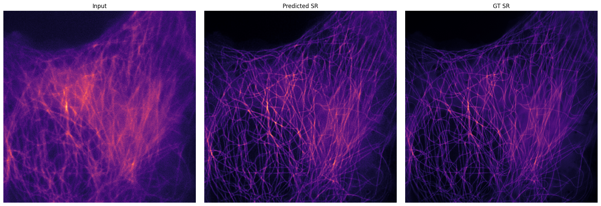

# RDL-denoising with PU-Net: A Deep Learning Approach Image Denoising for Microscopy

## 🗿 Introduction

Fluorescence microscopy is a powerful imaging technique that enables visualization
of biological specimens at
cellular and subcellular level with a resolution limit of 200-300 nm. The development of structured illumination microscopy (SIM) has further enhanced resolution by exploiting the interference of light patterns to achieve SIM reconstructions with two times resolution. However, imaging biological specimens under microscopy faces fundamental challenges, such as imaging speed, light exposure, and spatial resolution.

Achieving high‐quality SIM reconstructions critically depends on acquiring images with a high signal‐to‐noise ratio (SNR). However, several competing factors make this goal difficult to attain in practice. Rapid acquisition rates naturally decrease the average number of photons captured per frame, leading to a lower signal-to-noise ratio (SNR). Increasing excitation intensity to compensate for the risk of concealing information introduces the pitfalls of damaging the samples. Moreover, the intrinsic structural complexity of many biological specimens further degrades SIM performance under low‐SNR conditions, as fine features become obscured by noise.

In this work, we present an image denoising and SIM reconstruction approach based on our [Projection Upsampling Network (PU-Net)](https://github.com/ArghaSarker/projection_upsampling_network), which aims to replace the SIM reconstruction module, DFCAN, in the original RDL-SIM approach, as proposed by [Qiao et al., 2022](https://www.nature.com/articles/s41587-022-01471-3).

Below is an example of a SIM reconstrcution by PU-Net, which is then foprwared RDL-SIM for image denoising.

**Step 1:**

    

**Step 2:**

    

Below is an example of a SIM reconstrcution by DFCAN, which is then foprwared RDL-SIM for image denoising.

**Step 1:**

    

**Step 2:**

    

<!-- A simple package to use with caped

----------------------------------

This [caped] package was generated with [Cookiecutter] using [@caped]'s [cookiecutter-template] template. -->

## 🧾 Content
- Dataset Generation
- training example
    - SR
        - dataget
        - training dfcan
        - training PU-Net
        - prediction dfcan
        - prediction PU-Net
    - DN
        - datagen
        - training dfcan + rdl_sim
        - training PU-Net + rdl_sim
        - prediction dfcan + rdl_sim
        - prediction PU-Net + rdl_sim

- prediction example
- ImageJ Scripts for FairSIM  reconstruction

## Installation

You can install `RDL_denoising` via [pip]:

    pip install RDL_denoising

To install latest development version :

    pip install git+https://github.com/ArghaSarker/RDL_denoising.git

## ⚠️ Requirement
Python 3.7 and above.

## 🛡 License

Distributed under the terms of the [MIT] license,
"RDL-denoising with PU-Net" is free and open-source software

## 🐞 Issues

If you encounter any bugs or have suggestions for improvements, please open an issue on our repository. Your feedback is appreciated!

## 🙏 Acknowledgement

A huge thanks to [Dr. rer. nat. Varun Kapoor](https://github.com/kapoorlab) for his unwavering support and expert guidance that has been pivotal in shaping this codebase.

## 📚 References
1. Weigert et al. (2018)
Weigert, M., Schmidt, U., Boothe, T., Müller, A., Dibrov, A., Jain, A., Wilhelm, B., Schmidt, D., Broaddus, C., Culley, S., Rocha-Martins, M., Segovia-Miranda, F., Norden, C., Henriques, R., Zerial, M., Solimena, M., Rink, J., Tomancak, P., Royer, L., Jug, F., & Myers, E. W. (2018). Content-aware image restoration: pushing the limits of fluorescence microscopy. Nature Methods, 15(12), 1090–1097. https://doi.org/10.1038/s41592-018-0216-7

2. Qiao & Li (2022)
Qiao, C., & Li, D. (2022). BioSR: a biological image dataset for super-resolution microscopy. figshare. https://doi.org/10.6084/m9.figshare.13264793.v8

3. Marcel Müller, Viola Mönkemöller, Simon Hennig, Wolfgang Hübner, Thomas Huser (2016).
"Open-source image reconstruction of super-resolution structured illumination microscopy data in ImageJ",
Nature Communications, doi: 10.1038/ncomms10980

4. ArghaSarker, no date. GitHub - ArghaSarker/projection_upsampling_network: This is the repository for PU-Net, which is a deep learning based SIM reconstruction network for Structural Illumination Microscopy noisy image data., GitHub. (online: https://github.com/ArghaSarker/projection_upsampling_network).

[pip]: https://pypi.org/project/pip/
[caped]: https://github.com/Kapoorlabs-CAPED
[Cookiecutter]: https://github.com/audreyr/cookiecutter
[@caped]: https://github.com/Kapoorlabs-CAPED
[MIT]: http://opensource.org/licenses/MIT
[BSD-3]: http://opensource.org/licenses/BSD-3-Clause
[GNU GPL v3.0]: http://www.gnu.org/licenses/gpl-3.0.txt
[GNU LGPL v3.0]: http://www.gnu.org/licenses/lgpl-3.0.txt
[Apache Software License 2.0]: http://www.apache.org/licenses/LICENSE-2.0
[Mozilla Public License 2.0]: https://www.mozilla.org/media/MPL/2.0/index.txt
[cookiecutter-template]: https://github.com/Kapoorlabs-CAPED/cookiecutter-template

[file an issue]: https://github.com/ArghaSarker/RDL_denoising/issues

[caped]: https://github.com/Kapoorlabs-CAPED/
[tox]: https://tox.readthedocs.io/en/latest/
[pip]: https://pypi.org/project/pip/
[PyPI]: https://pypi.org/
